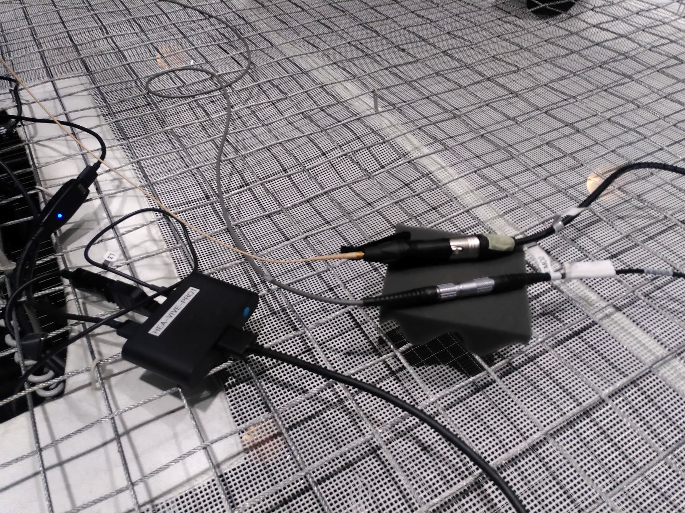
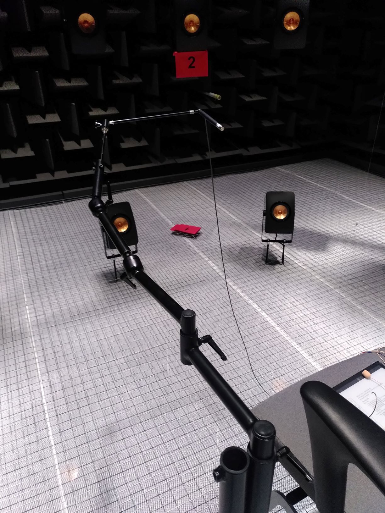
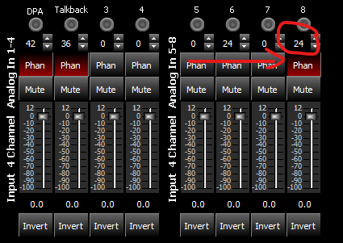
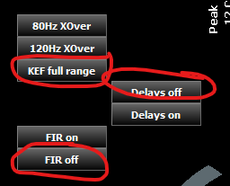
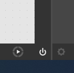
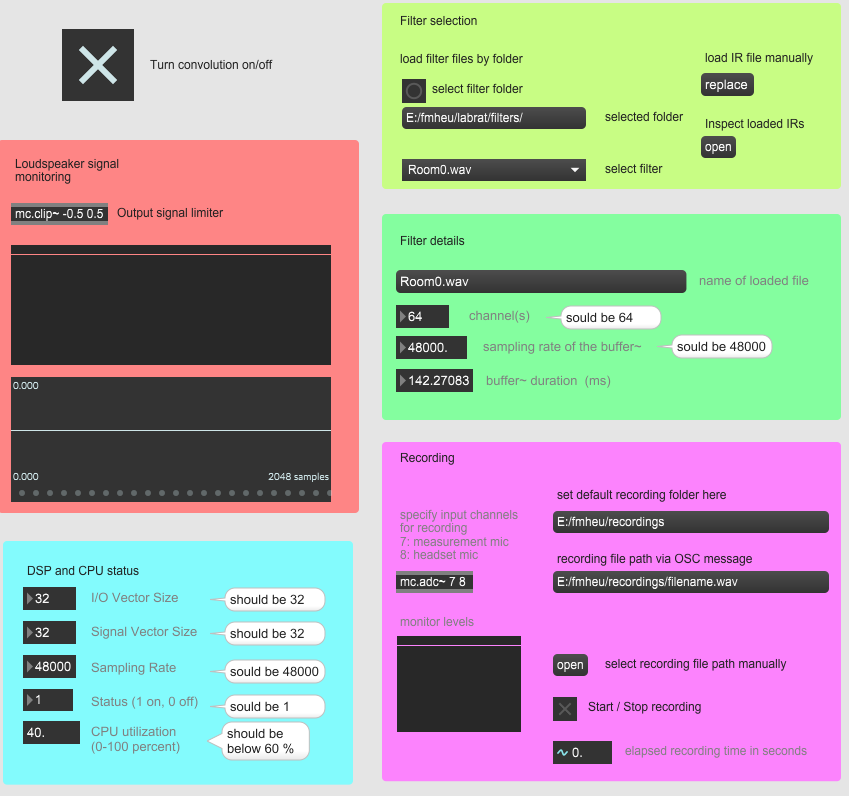
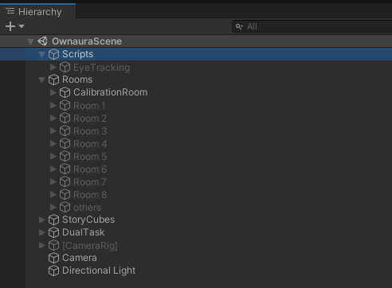
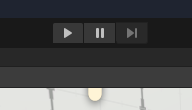
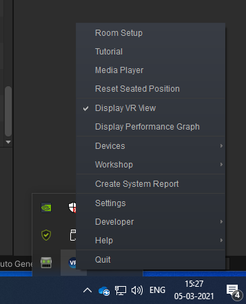
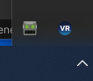

# Synopsis

Ownaura is an experimental framework for real-time auralization of speech. A
copy of the `OwnAura` project folder was placed on the department drive at
`O:\act\Projects\OwnAura`. The specific `OwnAura/VR` folder that contains the Unity project was also saved on the VR computer in front of AVIL in `C:\Users\Public\Documents\fmheu - OwnAura`.

## Description

The framework consists of several components:

1. a set of Odeon[^1] room simulations
2. a slightly modified variant of the Lora toolbox[^2]that converts the Odeon
   results into FIR filters for Ambisonic auralization
3. a set of Python scripts that
   - calibrates the magnitude spectrum of the Lora filters
4. a MAX[^3] patch that
   - real-time convolves the input audio stream with the calibrated Lora filters
   - records the participants voice stream for later analysis,
5. a Unity VR simulation that
   - renders the virtual experiment,
   - controls the experiment via keyboard input from the experimenter and
     controls the MAX patch via OSC messages
   - logs eye tracking data, the dual task completion times, and all other
     events

[^1]: [https://odeon.dk/](https://odeon.dk/)
[^2]: [https://bitbucket.org/hea-dtu/lora/src/master/](https://bitbucket.org/hea-dtu/lora/src/master/)
[^3]: [https://cycling74.com/products/max](https://cycling74.com/products/max)


The project makes use of both AVIL computers. The right-hand-side (RHS) computer
runs the MAX patch for real-time convolution and voice recording, and the Python
scripts for response preprocessing. The left-hand-side (LHS) computer runs the
Unity project and is the "command center" during the experiment. Experimental
data is saved on both computers and has to be manually merged.

The project requires the following equipment:

- measurement microphone B&K Type 4192 (is part of AVIL and should be found
  inside)
- headset microphone DPA 4088 (case is labeled "DPA 4088 ACT")
- mount for the measurement microphone (custom build from Henrik)
- arm for mounting mount to seat  (in closet outside of AVIL)
- Vive Pro Eye VR headset (in closet outside of AVIL)

The project is designed to be manually controlled by the experimenter via
keystrokes in Unity instead of hard-coding a certain order into some script.
This way, the order of the experiment process (rooms, dual task) is completely
flexible.

## Directory structure

The project directory `<OwnAuraDir>` has the following structure:

- `<OwnAuraDir>/Documentation`: source of this document
- `<OwnAuraDir>/libownaura`: Python and Matlab code, includes modified Lora
  toolbox
- `<OwnAuraDir>/Lora Filters`: running script inside computes Lora filters for
  each room in `<OwnAuraDir>/Odeon Rooms`
- `<OwnAuraDir>/MAX`: [MAX patches](#using-max), most importantly
  `convolver.maxpat`
- `<OwnAuraDir>/Odeon Rooms`: Odeon room simulations, one folder per room, each
  room with a `<OwnAuraDir>/AVIL implementation files` folder with simulation
  results in form of energy decay and early-reflection files
- `<OwnAuraDir>/Piloting`: some notes from Greta
- `<OwnAuraDir>/Story Cubes`: scanned images of the cubes
- `<OwnAuraDir>/VR`: the [Unity project](#using-unity)
- `<OwnAuraDir>/Validation`: manual and scripts for measuring acoustic
  parameters with HATS
- `<OwnAuraDir>/environment.yml`: for [creating python
  environment](#setting-up-a-python-environment-on-rhs-computer)

**Important**: Do not run the experiment from the original network directory
`O:\act\Projects\OwnAura`. This will be painfully slow. Instead, copy the VR
folder to a location on the LHS machine and the rest to a suitable
`<OwnAuraDir>` on the RHS machine.


## Special equipment

There are two special equipment pieces which I put into a basket named "OwnAura" and stored them in my (Franz) office:

- Headset microphone DPA 4088 + XLR adapter
- measurement-mic-to-avil-arm adapter

# TLDR

Quick summary of steps for each session (not including one-time setup like measuring AVIL transfer-functions or computing Lora filters from Odeon).

Before test subject arrives:

1. Set up equipment:
   - turn on DSP and Amplifiers
   - turn on Nexus pre-amplififer (check gain for channel 2 is 3.16 V/Pa)
   - connect headset and VR goggles
2. On right hand side computer
   - in _Red PCIe Card settings_ set buffer size to 32
   - in _BiampCanvas_ turn FIR filter and Delay OFF
   - in _Anacoda Powershell Prompt_:
     - make test subject folder and sub-directories:

       ```
       mkdir <testSubjectDir> <testSubjectDir>/filters <testSubjectDir>/recordings
       ```

     - change current directory to test subject folder

        ```
        cd <testSubjectDir>
        ```

     - activate python environment:

        ```
        conda activate ownaura
        ```

   - start `convolver.maxpat`
3. On left hand side computer open Unity project and in there
   - set test subject name under _Scripts_ object
   - Start Unity app via Play button

Place test subject with headset and VR goggles. To calibrate for test subject:

1. Make calibration recording
   - Make sure that MAX audio processing is ON and convolution is OFF.
   - In MAX, press open and select `<testSubjectDir>/calibration_recording.aif`
   - Ask subject to talk and record ~60s.
2. Make eye calibration:
   - In Unity, press play button and press `e` to start the eye calibration procedure.
3. Calibrate filters. In `Anacoda Powershell Prompt` with `<testSubjectDir>` as
   working directory
   - compute calibration filter

      ```
      python -m libownaura.compute_calibration_filter calibration_recording.aif
      ```

   - calibrate Lora filters

      ```
      python -m libownaura.calibrate_lora_filters `
      --calibration_file calibration_file.npz `
      --output_folder filters
      ```

3. Load filter folder in MAX: `select filter folder` as
   `<testSubjectDir>/filters`

Run the experiment. On Unity computer:

1. select a room via `0-9`
2. Start and stop a recording for that room by pressing `r`
3. Activate the dual task with `d`
4. Start and stop a recording for that room by pressing `r`
5. Deactivate the dual task with `d`
6. go back to 1. as necessary
7. At the end of the experiment (or any time in between) press the play button again to save any logs and stop any recordings

After the experiment:

- find the speech data in `<testSubjectDir>/recordings` on the right hand side
  machine
- find the eye tracking and dual task data in the
  `<OwnAuraDir>/VR/ExperimentData` on the left hand side machine
- change back latency to 2048 in `RED PCIe Card Settings`
- change back FIR Filter and Delay ON in `BiampCanvas`

# Preparation

## One time setup

Before trying anything of the below, make sure that you get admin rights for
both AVIL computers. Otherwise, you can neither change the buffer size of the
DSPs nor use eye tracking. (Andy gave Greta and Jonas already admin rights.)

### Setting up a Python environment on RHS computer

It is recommended to use `conda` to get a working Python environment on your
machine. If you don't have  `conda`, install the Python 3 64bit version of
miniconda[^4] (just always press next in the installer).

[^4]: [https://docs.conda.io/en/latest/miniconda.html](https://docs.conda.io/en/latest/miniconda.html)

After installation, run python commands via the `Anaconda Powershell Prompt`.
There, `cd` to the Ownaura project folder, e.g.

    cd OwnAura

Create a new Python environment called `ownaura` and install all required
packages using the command

    conda env create -f environment.yml

When starting the Powershell prompt, always activate the environment with

    conda activate ownaura

Always check that you are in the `(ownaura)` environment when you enter the
python commands below. Otherwise, you will get `ModuleNotFoundError`.

### Preparing AVIL

Inside AVIL (see [Fig 1](#fig:cable) and [Fig 2](#fig:arm)):

- place the measurement microphone into the arm and connect it to LEMO 2 (which
  is already connected via -> Nexus 2 -> input DSP #7 to the DSP)
- connect headset to XLR adapter to XLR IN2 *which us already connected to ->
  input DSP #8)
- be careful to place all cable connections on isolation material and not
  directly on the metallic grid
- Connect the VIVE Pro Eye headset to the outlet at the foot of the test subject
  seat and press the little blue button on the outlet to activate the headset.

{#fig:cable width=50%}

{#fig:arm width=50%}

In front of AVIL:

- Turn AVIL DSPs and amps ON by following the notes on the big black box close
  to the server rack
- Start the B&K Nexus preamplifier sitting on the right loudspeaker
   - Check that amplifier gain in channel 2 (Nexus 2) is 3.16 V / Pa. The
     measurement microphone will be connected to that channel.

On the right AVIL computer:

- Open `BiampCanvas` and connect by following the notes on the big black box
  close to the server rack. On the control surface do the following (see [Fig
  3](#fig:biampChan8) and [Fig 4](#fig:biampClick))
   - Check that phantom power for input 8 (headset) is activated
   - Set gain for input 8 to 24 dB
   - Click Delays OFF
   - Click FIR OFF
   - Click KEF full range
- From the Windows menu, start `Rednet PCIe Card Settings` and set Buffer Size
  to 32. _You need admin rights do change this._ Opening the program can take a
  while.
- Start the Max MSP patch at `<OwnAuraDir>/MAX/convolver.maxpat`
- Make sure you have the HISSTools package installed in Max. It can be downloaded from https://github.com/HISSTools/HISSTools_Impulse_Response_Toolbox but one can also install it directly from the Package Manager of Max. 

{#fig:biampChan8 width=49%}

{#fig:biampClick width=49%}

On the left AVIL VR computer:

- Start the Unity project at `<OwnAuraDir>/VR`. By opening `Unity Hub`, then
  press `Add` and select the `<OwnAuraDir>/VR` folder. Start the project by
  double clicking on the new item in the list. Another way is to directly start
  `Unity 2019.4...` and then selecting `<OwnAuraDir>/VR`.

### Computing Lora filters from Odeon simulations (only repeat when necessary)

With the `ownaura` environment activated, `cd` to `<OwnAuraDir>/Lora filters`.
Then

    python odeon_to_lora_filters.py

This will go through all folders in `<OwnAuraDir>/Odeon rooms` that have a `AVIL
implementation files` sub-folder with early reflection and energy-curve files
and compute ambisonics FIR filters for the AVIL setup using the Lora Toolbox. On
Windows, this could take up to 10 minutes, but it only has to be repeated
whenever the Odeon simulation files change.

### Measuring AVIL impulse responses (only repeat when necessary)

We need an estimate of the AVIL impulse responses to calibrate the Lora filters.
For setup:

- mount measurement microphone on tripod instead of the arm and place on seat
- correct seat height such that microphone is in center of loudspeaker array
- close doors

To start the measurement,

    python -m libownaura.measure_avil_impulse_responses

This will measure the impulse responses and save them as a file in the current
directory (e.g. `h_avil_2021-02-08T12-01-09.npz`). Let's call the path to that
file `<h_avil_file>`. For more options of this command, check `python -m
libownaura.measure_avil_impulse_responses --help`.

One can time window these responses before they are used to calibrate the
OwnAura system. Whether or not this is necessary or a good idea is not clear.
When time windowed, the system is calibrated only via its direct sound. In the
calibration room, this direct sound represents the first and only wall
reflection. A calibration with time window will reproduce this reflection with
an accurate magnitude. However, the total effective reverberant energy at the
listener position will be higher than expected as the calibration does not
account for the reverberant field inside AVIL.

If you would like to window the responses in time-domain, you can use

    python -m libownaura.time_window_impulse_response `
       -w "((0.0195, 0.0197), (0.023, 0.024))" `
       --debug `
       <h_avil_file>

which would save a response at `<h_avil_file>_windowed.npz` that is time
windowed between seconds 0.0195 and 0.023 with 0.1ms fade in time and 1ms fade
out time. The `--debug` flat makes the command plot some useful graphs for
inspection.

The AVIL impulse responses only have to be remeasured if something in the AVIL
setup changed.

## Calibrating for each test subject

The next steps are needed for each test subject. Before commencing, I recommend
to create a new `<testSubjectDir>` directory for each subject with the two
sub-directories `filters` and `recordings`. Use the DATA drive on the RHS
computer, e.g., `E:\fmheu\testSubjectDir\filters` and
`E:\fmheu\testSubjectDir\recordings`.

### Calibration recording

To adapt the system for each test subject, we need to measure the
transfer-function between the headset and the measurement microphone (at the 1m
away position). The MAX patch can be used for that.

1. start `<OwnAuraDir>/MAX/convolver.maxpat`
2. make sure that MAX' audio processing is turned ON and the convolution is
   turned OFF (see [Using Max](#using-max))
3. press `open` in the recording section of the MAX patch to manually select a
   file to record to, e.g. `<testSubjectDir>/calibration_recording.aif`
4. ask the test subject to start taking
5. record around 60s of voice using the Start/Stop toggle

### Calibration file

With the AVIL impulse response file and the calibration recording, use the
following command to compute a calibration file that will be used in the next
section to calibrate the Lora filters[^backticks]

    python -m libownaura.compute_calibration_filter `
    --h_avil_file <h_avil_file> `
    <testSubjectDir>/calibration_recording.aif

This will create the file `<testSubjectDir>/calibration_file.npz`.

[^backticks]: The backticks ``` in the command just enable writing the single
line command over multiple lines.

The `--h_avil_file <h_avil_file>` of the above command can be left out, e.g.,

    python -m libownaura.compute_calibration_filter `
    <testSubjectDir>/calibration_recording.aif

works as well. Then a default `<h_avil_file> ` will be used that is specified on
line 339 of the file
`<OwnAuraDir>/libownaura/libownaura/compute_calibration_filter.py` script. So
when you remeasure, just set that line to the new file.

### Calibrate Lora filters

Finally, using the calibration file and the Lora filters, we can create the
personalized Lora filters.

    python -m libownaura.calibrate_lora_filters `
    --calibration_file <testSubjectDir>/calibration_file.npz `
    --output_folder <testSubjectDir>/filters

You have now everything that is needed to start the experiment.

## Cleaning up after experiment

**Imprtant:** at the end of the day always

- in `Rednet PCIe Card Settings` set Buffer Size to 2048. _You need admin rights do change this._
- in `BiampCanvas`: set FIR ON and Delays ON

# During the experiment

## Using MAX

The MAX patch can be found at `<OwnAuraDir>//MAX/convolver.maxpat`. And might be
already opened for the recording of the calibration file. Here are some more
details. It was written in MAX 8. Without a license, the patch can be run but
not changed. The patch depends on the `multiconvolve~` object from the
[HISStools](https://github.com/HISSTools/HISSTools_Impulse_Response_Toolbox)
package, which can be installed via MAX's package manager.[^](Already installed
on the LHS machine.) The patch uses the `poly~` object to run the convolution
with separate `multiconvolve~` objects on all CPU cores. It is thus important to
close all other applications as these could take resources needed for the
convolution process.

{#fig:DSPbutton}

Similar to Unity's play button, MAX has an ON/OFF switch in the lower right that
toggles the state of the audio processing system (blue means on). When the
simulation in Unity is started via the play button, it sends a OSC message to
the MAX patch that turns it on. It is automatically stopped, when the simulation
is stopped in Unity. Note that for the [calibration
recording](#calibration-recording), the audio processing has to turned on
manually!

{#fig:MAXpatch}


[Fig 6](#fig:MAXpatch) shows the interface of the patch. It implements two main
functionalities: 1) convolving the headset microphone signal with the calibrated
Lora filters for playback over the loudspeaker array and 2) recording the
headset microphone signal to disk.

Toggle the convolution on and off with the big button on the upper left. This
will just stop sending the signals to the convolver object without stopping
MAX's audio processing, that is, one can still record incoming audio to disk.

In the filter selection section, one can set the filters. Select a folder, e.g.
`<testSubjectDir>/filters` with the button at `select filter folder` and then
select any filter in that folder via the drop-down menu (`select filter`).
Another option is to select a filter directly (`load IR file manually`). For the
interplay with Unity, only use the first option via the folder: when rooms are
switched in Unity via the number keys, the respective filter in the drop-down
menu is automatically selected. For example, pressing `0` activates the first
room of Unity's `Rooms` object and then sends a OSC message to the MAX patch
that loads the first filter present in the drop-down menu.

When a filter is loaded into MAX's buffer, some details of it can be seen in the
`Filter details` section.

In the recordings section, `select recordings folder` to
`<testSubjectDir>/recordings`. When a recording is triggered in Unity via the
`R` key, a message is sent to the MAX patch specifying the name of the
recording. That file will be placed that directory.

The input channels that are recorded can be specified in the `mc.adc~` object,
e.g. `mc.adc~ 7 8` would record at input channels 7 and 8 (the measurement
microphone and the headset).

To manually record to a file, e.g. for the calibration recording, press `open`
and specify a file location. Then press the `Start / Stop recording` button to
start or stop a recording. To see if the patch is currently recording, see if
the `elapsed recording time in seconds` is increasing.

Some settings and status parameters are shown in the `DSP and CPU status`
section. If the IO vector size is not 32, it has to be changed via the  `Red
PCIe Card Settings` program. If the CPU utilization is too high, there will be
audible artifacts (clicks), in that case, close any other running apps and
processes on the MAX machine or use a shorter filter (see
[Troubleshooting](#troubleshooting)).

The loudspeaker signals can be monitored in the `Loudspeaker signal monitoring`
section.

## Using Unity

The Unity project can be found in the `<OwnAuraDir>/VR` directory. It is based
on the 2019.4 LTS version and requires SteamVR for interfacing with the VR
equipment and
[SRanipal](https://developer.vive.com/resources/vive-sense/sdk/vive-eye-tracking-sdk-sranipal/)
for the eye tracking feature.[^](These are already installed on the LHS
machine, but might need to be updated for every new user.)

### The Hierarchy

All GameObjects and scripts of a Unity scene are managed via the Hierarchy on
the left hand side of the Unity window. In this project, it should look similar
to the image below.



The first object, `Scripts`, holds all scripts that handle the experiment logic.
Click on the object to open its inspector on the right window side. In the
inspector, all parameters of the experiment can be set manually. The function of
most parameters should be intuitive and some of them have a little text above
them with descriptions.

The script handling the eye tracking is grouped via its own object `EyeTracking`
in the hierarchy. This makes it easy to disable the EyeTracking feature if one
is working on a machine without support (e.g. for development). To toggle the
activation status of the EyeTracking object, select the object and in the
inspector press the small box just next to the object name. Here, one can also
change the data rate of the eye track logger.

`Rooms`, the third object in the hierarchy, is a container for different room
objects. The order of these objects is important: in play mode, you can use the
keys `0-9` to switch between rooms: a press to any of them will deactivate all
rooms and then activate the selected room where `0` corresponds to the first
room in the container (`Calibration room`), `1` to the second (`Room 1`)and so
forth.[^changegeo]

[^]: If you want to change the geometries for any room, switch out the child
objects of the room objects (e.g. `16x12x4.5`) or add additional objects as
children to the respective room objects. Do not change the parent objects
themselves.

The `StoryCubes` object holds the set of story cubes. Do not try to manually
edit them as these are automatically created via the `StoryCubeScript.cs`
component of the `Script` object. Use the parameters there to edit the position
and number of story cubes.

The `DualTask` object holds two objects: the `DualTaskSphere` is the object that
appears and disappears for the dual task. Its placement is controlled via the
`DualTask.cs` component of the `Scripts` object. If you want to change the shape
or color of this object you can do it via the Inspector. If you would like to
use another object instead of the sphere, be sure to link your new object into
the `DualTaskObject` attribute of the `DualTask` component in the `Scripts`
object, such that the script knows which object it should move around.

The `DualTaskSpaces` object contains the invisible space which defines the space
in which the `DualTask` object appears randomly. You can add any amount of
invisible objects to this object and the `DualTask.cs` script will use these
spaces to place the DualTask object in them with a constant probability density.
(In the current state, there are two of such space objects but one is
sufficient.)

The `[CameraRig]` object should be activated when the VR system is connected. As
an alternative for development on a machine without VR system, activate the
`Camera` object instead (and deactivate `[CameraRig]`). With that object
activated, you can move the camera in play mode by holding the left mouse
button.

### Running the project

To start the VR project, press the play button in the top center of the screen.
If eye tracking is activated, you might see a Windows dialog asking for
permissions for the SR runtime: select `yes`.



When in play mode, _none_ of the changes to the game or parameters are
permanent, that is, they are lost when exiting play mode. For making permanent
changes to the project exit the play mode by pressing the play button again and
then make your changes.

In play mode, the following key controls are available for the experimenter at
the keyboard:

- `0-9`: switch to any of the rooms in the order they are represented in the
  `Rooms` object. This will also send a OSC message to the MAX patch that
  switches convolution to the respective filters in the drop-down menu.
  Switching rooms will deactivate the dual task and send an OSC message to the
  MAX patch to stop any current recording.
- `C`: toggle convolver status ON/OFF
- `D`: toggle the dual task ON/OFF. The current status of the dual task is
  visible in the inspector of the `Scripts` object. Toggling also triggers a log
  message in the console.
- `R`: start or stop recording by sending a message to the MAX patch that either
  starts a new recording or stops a current recording. The filename of the
  recording is automatically created depending on the current subject, the
  current room and the current status of the dual task. So always make sure to
  start recording _after_ toggling the dual task.
- `spacebar`: trigger rolling of the story cubes (for development if no VR
  controller is available)
- `T`: trigger the dual task (for development if no VR controller is available)
- `E`: start the eye calibration procedure. There is no way to abort the
  procedure.

In play mode, the following key controls are available for the test subject with
the VIVE controller:

- trigger on the backside (`GrapPinch`): trigger the dual task
- large round pad press left/right (`PadPress`): trigger rolling of the story
  cubes

All keys can be remapped in the `Update` method of the `Manager.cs` script.

### Monitoring the experiment and retrieving data

Every time the play button is pressed or the room is changed via the `0-9` keys,
a new folder is created in the `<experiment folder>` specified in the `Scripts`
object. The folder name consists of a date-time stamp, the subjects name and the
activated room. In the folder, there are three files that log the Dual Task
times, data from the eye tracking (pupiliometery and eye-openness (ranging from
0 to 1)), and any action that the participant or the experimenter takes. In the
console at the bottom of the unity window, these events are also displayed to
monitor everything that happens during the experiment.

# Difference to Pelegrin-Garcia 2011: Loudspeaker-based system for real-time own-voice auralization

The system is very similar. The main difference in implementation are:

- The system is implemented in an approximately anechoic chamber.
- The system is calibrated in time: For the calibration room, the reproduced
  reflection arrives at the speaker with the time delay of the simulation (there
  is no explicit mentioning of time calibration in David's work). This holds for
  any reflection arriving after 22ms.
- The Lora toolbox is modified such that reflections in the first 22ms are
  shifted by 22ms. Otherwise, the time-calibration would produce non-causal
  filters.
- Instead of calibrating in real-time via an EQ applied to the voice signal (cf
  Fig.1 in David's paper), the calibration is applied to the Lora filters in a
  preprocessing step (this enables the time-calibration)

The calibration filter is computed as follows. At a single frequency, let $A =
[A_1, A_2, \dots, A_{64}]^T$ be the vector of transfer-functions between the
convolver and the center of the array through each loudspeaker. Let $W = [W_1,
W_2, \dots, W_{64}]^T$ be the frequency response of the Lora filters for the
calibration room. Let $C$ be the calibration filter. The total transfer-function
between convolver and the center of the array that reproduces the reflected
sound is

$$H_{refl, avil} = A^T W C.$$

The direct sound in AVIL is quantified with the transfer-function $H_{direct,
avil}$ which is estimated during the calibration measurement by a causally
constrained Wiener filter between the headset and the measurement mic using
Welch's method with a window of $M=1024$ samples (at 48kHz samplerate) (see
function `compute_H_step2` in `calibrate_calibration_filter.py`).

Further, let $H_{direct, sim}$ and $H_{refl, sim}$ be the simulated
transfer-function representing the direct and the reflected sound in the
calibration room. The goal of the calibration is to determine $C$ such that the
system reproduces the same reflections as the simulation, given some direct
sound, i.e.,

$$\frac{H_{refl, sim}}{H_{direct, sim}} = \frac{H_{refl, avil}}{H_{direct, avil}}.$$

or

$$C =  \frac{H_{refl, sim}}{H_{direct, sim}} \frac{H_{direct, avil} (A^T W)^*}{|A^T W|^2 + \epsilon}$$

where $\epsilon$ is a regularization parameter.

However, $C$ will in general not be causal and as such, not realizeable in
real-time. Instead, we approximate $C$ by a minimum-phase FIR filter (with DFT
$C_{min}$) with $N=511$ taps and magnitude $|C|$ and a simple (negative) delay
$\tau$ such that

$$ C(\omega) \approx C_{min}(\omega) \exp{(-\omega \tau)}.$$

When applying the calibration filter, the negative delay is implemented by
removing samples at the beginning of the Lora filters (approx. the first 21ms).

The parameters $\epsilon$, $M$, $N$ (and also the regularization of the Wiener
filter $H_{direct, avil}$) can be set when running the calibration command. For
more info, see help `python -m libownaura.calibrate_calibration_filter.py
--help`.


# Estimating the effective AVIL room acoustic parameters using HATS

The folder `<OwnAuraDir>/Room acoustic parameter measurement` contains scripts
for estimating the reproduced room acoustic parameters like Voice support, room
gain, and decay time using the transfer-function measurements with the
Head-and-torso-simulator (HATS).

For the setup, do as described in section [Preparing Avil](#preparing-avil).
Additionally

1. place HATS on seat
     - correct seat height such that head is in center
     - correct distance of measurement microphone to head center to 1m
     - place headset on HATS
2. connect XLR OUT 1 to amplfier and amplifier to HATS' mouth

To calibrate the OwnAura system, we let HATS speak white noise:

1. start the noise generator in the patch `MAX/noise_generator.maxpat`
2. record 60s of noise using the patch `MAX/convolver.maxpat`
   - same procedure as with calibrating for a human
   - save as `HatsDir/calibration_recording.aif`
   - close `MAX/noise_generator.maxpat`
3. compute the calibration file

   ```
   cd HatsDir
   python -m libownaura.compute_calibration_filter `
    --h_avil_file <h_avil_file> `
    calibration_recording.aif
   ```

   and the calibrated lora filters

   ```
   python -m libownaura.calibrate_lora_filters `
    --calibration_file calibration_file.npz `
    --output_folder filters
   ```

To measure with both ears of HATS,

6. connect HATS microphones to
    + LEMO 1 (which is connected to NEXUS 1 -> input DSP #5) and
    + LEMO 2 (which is connected to NEXUS 2 -> input DSP #7) (you have to
      disconnect the measurement microphone which is not needed anymore)
7. set the amplifier gain in NEXUS to 1 V/Pa for _both_ channels

Now, everything is ready for some sweep measurements. We want to play sweeps
through HATS mouth and record them with HATS ears. For each room

8. prepare convolution system
   - Start `MAX/convolver.maxpat` if not already open
   - load the filters in the folder `HatsDir/filters`
   - select filter in dropdown menu
   - make sure convolition and audio processing is ON
9. make a sweep measurement with `MAX/record_all_mics.maxpat`
   - select one of the provided sweeps
   - save the recordings in `HatsDir/recordings`
   - chose some reasonable level
   - start the recording. It ends automatically.

Make sure to also make one recording with convolution turned OFF and call that
file `HatsDir/Anechoic.aif`. This Anechoic recording will be used for
computation of the room gain.

At last, run the provided script to analyize all recordings in
`HatsDir/recordings` and save the room parameters in a file
`estimate_room_parameter.csv`

    cd <OwnAuraDir>/Room acoustic parameter measurement
    python compute_room_acoustic_parameters.py


Note: You can choose from several sweep lengths (or create more sweeps with the
`make_sweep.py` script). Long sweeps are necessary for the estimation of the
decay time. Especially for the anechoic case, the energy drops very fast to the
noise floor. This makes it difficult to estimate the 40dB or 30dB drop time from
the backwards integrated energy responses. I used the the long 240s sweep for
the Anechoic condition and 120s sweeps for the rooms to save some time when I
did this experiment. Using different sweep lengths makes the estimate of the
room gains inaccurate, as recordings of different lengths have a different
amount of noise. I recommend to measure each room with the long sweep. The
processing can take quite some time in that case.

# Troubleshooting

- _The MAX patch is not reacting to the commands in Unity_: make sure that the
  IP address and port are correctly specified in the `Scipts` object in Unity.
- The VR simulation starts at a completely wrong height/position: right click on
  the SteamVR tray icon and select `Room Setup`.

   {width=60%}

- _There is an error when starting the Unity simulation_: make sure that an
  eye-tracking enabled VR headset is connected. And the SRanipal robot has green
  eyes. If you want to develop without a proper headset connected, disable the
  `EyeTracking` and `CameraRig` objects.

   

- _I need more information on the Python scripts_: Append the `-h` or `--help`
  flags to any of the commands to get a help text e.g.

    `python -m libownaura.compute_calibration_filter --help`

  Append the `--debug` flag to turn on plotting of interesting quantities.

- _I get a `ModuleNotFoundError` when running Python scripts_: make sure you
  have the python environment activated with `conda activate ownaura`

- _I get `ValueError: No output device matching 'RedNet PCIe'` when measuring
  the AVIL transfer-functions_: Only one process can use the sound card at the
  same time. Make sure to close any other processes that could use the sound
  card, e.g., MAX must be closed for this measurement. There might also be other
  users still logged in with a program open that uses the sound card. Also make
  sure that the DSP's are turned on.

- _I can't find my data_: the recordings are saved in the folder specified in
  MAX (`set default recording folder here`) and the eye tracking and unity
  logging is saved in the folder specified in the inspector of the `Scripts`
  object. This folder might be in the `OwnAura/VR` Unity project folder on the
  LHS machine.

- _There is some wierd clicking noise coming out of the loudspeakers_: make sure
  that there are no other processes than MAX running on the RHS computer. The
  MAX patch needs all resources from all cores.Make sure that no other users is
  logged in (you can see that in the Task manager with CTRL+ALT+DELETE).

- _I can't write/move/delete a recordings file (e.g. used by another process)_:
  It is important that you stop the recordings properly (via pressing `R` in the
  LHS machine or via the start stop buttons on the RHS machine). Otherwise, the
  file might still be "locked" by MAX. In that case, close all MAX processes
  (task manager) and try moving / deleting the file.

- _A lot of energy (much more than 2%) is cut off by the `python -m
  libownaura.calibrate_lora_filters` command_: check the distance of the
  measurement microphone to the test subject head (should be 1m). Also, check
  that the buffer size on the RHS machine is correctly set to 32 (see [Preparing
  AVIL](#preparing-avil)).

  By default, the `odeon_to_lora_filters.py` script moves early reflections out
  of the first 22ms leaving the beginning of the responses to be approximately
  0. Then, the `calibrate_lora_filters.py` script can chop of the beginning of
  responses to correctly time align them and account for the latency in the
  system. If the system latency is to large or the subject too far from the
  measurement microphone, more than 22ms will be chopped off for correct time
  alignment, leading to the removal of some of the earliest reflections as well.

  You can change the amount the early reflections are moved in the
  `odeon_to_lora_filters.py` script via the `move_ER` variable (around line 27).

- _I don't see the eye calibration happening when pressing `e`_: The eye
  calibration is an overlay over the Unity app. Thus, you can't see it happening
  in the Unity window. You can however see it in the VR viewer that one can
  activate by right clicking on the SteamVR tray icon and selecting `Display VR
  view` (see figure above).

- _There are all kinds of error messages in the log when opening the MAX patch_:
  The two kind of messages `patchord outlet out of range` and `buffer b1 is not
  valid` are not a problem and can be savely ignored.